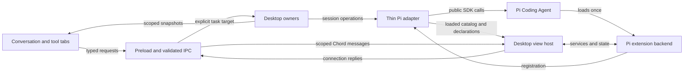

# Workspace redesign: implementation design

Status: **implemented and verified within the documented macOS scope**, September 22, 2026. P0.0–P0.2 have the historical proof below; P0.3/P0.4 review/capture and P1.1/P1.2 extension views passed the final baseline, Core Electron, real-provider and local packaged-app gates. See the [verification report](workspace-redesign-verification.md) for exact evidence and limits. This is not a published/notarized release or Windows/Linux verification. The approved tabbed prototype and installed Pi/Chord `0.87.1` are the current baseline; the earlier blocks-first protocol proposal is superseded.

## Recommendation

The conversation remains the main surface. Files, Changes, Worktrees, Terminal, and optional extension views share one companion workspace with task-local tabs. The Pi 0.87.0 upgrade and built-in workspace foundation preceded review/capture and extension hosting, retaining the established desktop owners.

The composer keeps both model and reasoning level visible. The side-workspace toggle is icon-only, with an accessible name, tooltip, pressed state, and existing keyboard shortcut. Appearance and density stay in Settings. There is no local/cloud picker when only local operation exists.

Chord supplies extension services, replicated state and facet lifecycle. Pi-gui supplies the desktop view host and a small registration adapter to existing Pi extensions. Authors provide browser interfaces rather than a fixed blocks schema. The [custom frontend design](chord-desktop-extension-design.md) records the implemented contract, ownership and verification scope. Its Pi EventBus bridge performs discovery only.

## Baseline behavior before the workspace foundation

| Area         | Historical baseline                                                                                                               | Implemented direction                                                                                                      |
| ------------ | --------------------------------------------------------------------------------------------------------------------------------- | -------------------------------------------------------------------------------------------------------------------------- |
| Shell        | `App.tsx` separately owns Files/Changes mode, document tabs, and terminal visibility. Selection changes clear some of this state. | One workbench controller owns opening, focusing, closing, hiding, and restoring tools.                                     |
| Conversation | Draft synchronization, timeline viewport, explicit session targeting, queued messages, model/thinking controls already exist.     | Recompose and restyle these features; preserve their behavior and ownership.                                               |
| Changes      | Current working-tree status, grouped across checkout contexts. The file-diff helper prefers unstaged over staged content.         | Explicit checkout and comparison, correct partial-staging presentation, then branch and captured-turn review.              |
| Terminal     | Main owns PTYs, scoped by window, canonical checkout, and task. Renderer unmount does not terminate them.                         | Render the same service in a tool tab; view lifetime remains separate from shell lifetime.                                 |
| Extensions   | Pi UI calls become dialogs, notifications, status, and text widgets. The app has no desktop view registration API.                | Preserve existing compatibility and add registered browser views connected through Chord to the original Pi extension.     |
| Persistence  | Pi owns session data; catalogs own workspace/session records; desktop owns validated UI state.                                    | Add layout preferences and review metadata to desktop-owned storage; do not copy Pi history or extension findings into it. |

Baseline: `f06a5501dbcf1f39e105f0375ae7646bd9841c8f`. Current source: [shell](../apps/desktop/src/app/App.tsx), [draft synchronization](../apps/desktop/src/features/conversation/hooks/use-composer-draft-sync.ts), [desktop owners](architecture.md), [UI persistence](../apps/desktop/electron/persistence/app-store-persistence.ts), [Git diff adapter](../apps/desktop/electron/platform/files/app-store-diff.ts), [extension binding](../packages/pi-sdk-driver/src/session-supervisor.ts).

## Implemented workspace foundation

The live layout now follows one [workbench controller](../apps/desktop/src/features/workbench/use-workbench.ts) and [reducer](../apps/desktop/src/features/workbench/workbench-state.ts). Files, Changes, Worktrees and Terminal share the outer tab strip and chooser. A single icon toggles visibility. Files keeps its document tabs; Terminal keeps its shell tabs and process owner. The old picker, bottom terminal drawer and independent visibility flags are removed.

Each task retains its ordered tools, selected tool, visibility, file references and selected Changes checkout/path. Settings does not clear that layout. File refresh no longer deletes saved document tabs; a missing file remains an explicit read error. Last-shell close callbacks are invalidated when their view unmounts, so they cannot close another task's tool tab. Worktrees uses the existing checkout/task navigation and creation operations.

The [browser-safe contract](../apps/desktop/contracts/workbench.ts) is also the strict persistence/IPC decoder. Main stores the last explicit layout template per task, outside broadcast snapshots. Windows restore once and keep independent live state. Early interactions are rebased onto the saved template after loading; failed restores offer Retry and do not overwrite unknown saved layout. Main serializes saves, rejects stale per-renderer sequence numbers and resets that sequence on renderer navigation. Schema v19 adds `changes.scope`; v18 layouts without it restore Uncommitted. Migration preserves a separate, immutable copy of the original validated pre-migration bytes, including a v18 source file.

Neutral Default light/dark colors, consistent spacing, a quieter sidebar and composer, and the tab styles use the existing token system. Named themes retain their own colors. Model and reasoning controls remain visible. Existing conversation controllers and the single timeline viewport owner remain in place. Registered extension views now appear in the chooser. A saved extension tab whose registration is missing or broken remains visible with an unavailable reason and recovery/close controls.

## Implemented extension example

A user opens **+ → PR Review**, asks Pi to review, and creates a fix task:

1. The workbench adds or focuses the extension's tool tab for the selected task. Opening the tab does not start a review.
2. Pi-gui's view host mounts the extension's desktop interface and connects it to the backend for that exact Pi session. The custom frontend and its connection are scoped to the current runtime generation.
3. The user refreshes the real GitHub PR and presses **Review with Pi**. The frontend calls the extension's backend through Chord. Pi's public `sendUserMessage` returns before admission, so the example displays Requested until the matching Pi hook confirms Running. Transcript and normal Stop controls show the actual run.
4. The extension saves its findings in Pi extension state and updates the state exposed to its frontend. The frontend renders the findings with its own layout. Its live state is a projection, not a second durable findings store.
5. **Create fix task** calls a narrow host action which prepares a draft in the PR's checkout. The user sends it through the normal composer.
6. Closing PR Review releases its presentation and subscriptions. Findings and commands remain available. A stale connection or changed task rejects presentation; results remain with the extension and are not automatically replayed.

The second example, **Test Runs**, executes fixed local `node:test` suites through Pi's released bash operations, streams bounded output, and supports explicit Stop and timeout. Both are ordinary file-based extensions using the same local helper and host; neither requires a feature-specific desktop IPC route. See the [local author workflow](../examples/desktop-extensions/README.md).



Arrows describe requests/data flow. The renderer never imports the host or Pi implementation.

## Components and ownership

| Component              | Owns                                                                               | Location and change                                                                                                                                                              |
| ---------------------- | ---------------------------------------------------------------------------------- | -------------------------------------------------------------------------------------------------------------------------------------------------------------------------------- |
| App shell              | Startup/recovery, sidebar, app routes, composition                                 | Slim down `src/app/App.tsx`; keep Settings/Extensions/Skills/schedules reachable.                                                                                                |
| Conversation screen    | Selected task's transcript/composer composition                                    | Currently composed in `src/app/App.tsx` using the existing draft, viewport, attachment and command controllers; a separate screen module is not required for the tab foundation. |
| Workbench              | Current window's per-task tool order, active tool, visibility and view preferences | New `src/features/workbench/workbench.tsx`, `workbench-state.ts`, `use-workbench.ts`; replace the old picker and parallel visibility paths.                                      |
| Tool content           | Files and inner document tabs, review, terminal shells, worktree navigation        | Reuse/adapt existing feature components. A small explicit built-in resolver is enough.                                                                                           |
| Durable layout storage | Validated last-saved layout template per task                                      | Extend `electron/persistence/app-store-persistence.ts`, narrow application-store operations, and IPC. No new renderer localStorage path.                                         |
| Review owner           | Comparison identities, pinned revisions and revision-scoped reviewed marks         | `electron/workbench/review-owner.ts`, `reviewed-store.ts`, and `electron/platform/files/git-review.ts`.                                                                          |
| Checkpoint store       | App-owned Git snapshots, interval metadata and transcript lookup                   | `electron/workbench/checkpoint-store.ts`; receives portable capture boundaries, never drives Pi or task selection.                                                               |
| Desktop view host      | Registration, backend hosts, scoped connections, assets and allowed host actions   | `electron/extensions/extension-view-owner.ts`, `extension-view-source.ts`, `extension-view-actions.ts`; renderer `extension-view-panel.tsx` owns the iframe/port.                |
| Pi adapter             | Session lifecycle and translation to public Pi APIs                                | Extend `packages/pi-sdk-driver` narrowly; no tab layout, Git checkpoint implementation, React, or PR business rules here.                                                        |

Browser-safe contracts live in `apps/desktop/contracts/workbench.ts`, `review.ts` and `extension-views.ts`. `packages/session-driver/src/turn-capture.ts` carries portable capture identities and boundaries. `packages/extension-ui` owns registration, browser host-action types and the Chord wire adapter; `packages/pi-sdk-driver/src/desktop-extension-bridge.ts` adapts discovery to Pi's loaded catalog. Shared packages have no dependency on desktop implementation, and Chord owns service/state semantics.

The workbench reducer is the only writer of live layout in a renderer window. Main's existing persistence owner is the only writer of its durable representation. These are separate responsibilities: main supplies restore templates, not a second live layout controller.

## Task, checkout, and tab identity

Use the existing `SessionRef` (`workspaceId`, `sessionId`) as task identity. A viewed checkout is a separate explicit workspace reference. Never infer operation targets from the globally selected task after awaiting an operation.

```ts
type ToolRef =
  | { kind: "files" }
  | { kind: "changes" }
  | { kind: "worktrees" }
  | { kind: "terminal" }
  | { kind: "extension"; extensionId: string; viewId: string };

type ToolSelection = { kind: "chooser" } | { kind: "tool"; toolId: string };

interface TaskWorkbenchTemplate {
  visibility: "visible" | "hidden";
  tools: readonly ToolRef[];
  selection: ToolSelection;
  files: FileViewState; // existing document-tab model, checkout + path
  changes: { workspaceId: string; selectedPath: string | null; scope: ReviewScope };
}
```

The reducer and saved-state decoder enforce unique tool identity and selected-tool membership. Invalid external data is rejected before it reaches that reducer. File references are resolved through existing host path validation; a missing file does not silently open an unrelated path.

- One outer tab per built-in tool; Files retains its inner document tabs and Terminal its inner shell tabs. Do not flatten those different resources into the outer strip in this iteration.
- Reopening a tool focuses it. Closing the active tool selects its neighbor; closing the last shows the chooser. Hidden layout retains selection and tool state.
- With no saved layout, existing tasks start with Changes on Uncommitted; a new unsent task starts with its side workspace hidden. Completion may update data but does not steal focus or replace the selected tool. A transcript Review action resolves that exact persisted message to a checkpoint and opens its turn comparison. An uncaptured message stays unavailable instead of falling back to the latest turn.
- Close Terminal's outer tab means close its view. An explicit shell-close action terminates that shell. App/window exit retains existing PTY disposal semantics; restoring a saved tab does not claim a live process survived.
- Settings and Extensions are management routes; entering/leaving them does not mutate task layout. Their return action and Escape restore the prior workspace.
- Each window keeps its own live per-task layouts. Opening the same task in a second window seeds from its last-saved template; subsequent clicks do not rearrange the other window. The last explicit layout change wins the durable template. Serialize writes and reject older saves from the same renderer; async data refreshes never write layout.
- Save only references and small preferences. File bytes, diff bodies, terminal replay, extension results and transcripts remain with their respective owners.

Production clarification to the prototype: a checkout switch must not silently move a conversation's runtime or a live shell. Worktrees opens an existing task or creates a new task in the selected checkout. Files/Changes may explicitly browse another checkout. A future conversation-move feature would be a separate operation with its own proof.

## Conversation behavior and visual foundation

Keep the existing draft flush before task switch, immediate targeted Stop path, model/think-setting scope, slash/mention discovery, attachments, queue editing, and timeline reading anchors. Preserve current queue/steer semantics and labels during this redesign rather than copying the prototype's simplified simulation.

Use existing `src/ui` and `src/styles` as the single source for typography, spacing, surfaces, borders, controls, focus rings and light/dark colors. Apply tokens to built-in and extension components. Avoid a second component library or extension-specific theme system. Density is a Settings preference affecting spacing; it must not remove composer controls or shrink readable text.

Derive user-facing activity from real runtime events and pending input requests. Persist the last known run outcome needed to distinguish completed, stopped, failed and interrupted work. An app restart without a live recoverable runtime means interrupted; a continuation starts through supported Pi APIs and must not be described as restoring the old JavaScript execution. No new scheduler or custom agent loop is part of this plan.

Success includes keyboard access, stable composer focus, sensible empty/error states, long transcripts, background completion/unread state, and truthful run controls. Keep the existing timeline viewport owner as the sole scroll writer.

## Review is a comparison, not a panel mode

```ts
type ReviewScope =
  | { kind: "uncommitted" }
  | { kind: "branch"; baseRef?: string }
  | { kind: "turn"; checkpointId?: string };

getReview(input: { target: SessionRef; checkoutId: string; scope: ReviewScope }): Promise<ReviewResult>;
getReviewFile(input: { reviewId: string; fileId: string }): Promise<ReviewFileResult>;
resolveTurnReview(input: { target: SessionRef; messageId: string }): Promise<ResolveTurnReviewResult>;
```

The [review contract](../apps/desktop/contracts/review.ts) returns `available | stale | unavailable | failed`. Available results include an immutable comparison identity, resolved checkout/revisions, file identities and `complete | partial` coverage with notes. The [review owner](../apps/desktop/electron/workbench/review-owner.ts) retains up to 16 comparisons in memory. File reads, reviewed marks and staging use the returned comparison/file IDs; evicted or changed comparisons require Refresh. The requested scope is persisted, but asynchronous resolution never writes layout: Branch without `baseRef` resolves the repository default again on refresh; Last turn without `checkpointId` means latest. A transcript action stores an exact checkpoint ID.

Reviewed marks live in host-owned `reviewed-files.json`, keyed by task, checkout, scope and file-content identity. Changes invalidate the relevant mark, and restarting can retain marks for unchanged content. Renderer-local path-only marks are no longer read or written; old bytes are left intact. Temporary Git errors do not erase marks.

| Scope       | Meaning                                                                                                | Edge behavior                                                                                                                                                                 |
| ----------- | ------------------------------------------------------------------------------------------------------ | ----------------------------------------------------------------------------------------------------------------------------------------------------------------------------- |
| Uncommitted | HEAD to current tracked contents, plus nonignored untracked files; staged/unstaged indicators retained | Partially staged files expose both portions, including staged changes cancelled by later edits. Empty/unborn repositories use an empty baseline.                              |
| Branch      | Merge-base of selected base and HEAD to pinned HEAD                                                    | Excludes dirty edits. Default resolution prefers the tracking remote's HEAD, then a sole remote HEAD, then the branch's upstream. Missing or unrelated bases are unavailable. |
| Last turn   | Saved before/after contents for a user-facing interval                                                 | Never substitutes a HEAD diff. Uncaptured/imported history stays unavailable. Stopped/failed/interrupted intervals with both captures carry partial-coverage notes.           |

Uncommitted exposes Combined (HEAD → current bytes), Staged (HEAD → index) and Unstaged (index → current bytes), including changes that cancel out in Combined. Reads check freshness around file access. Changed content returns stale rather than a new patch under an old identity. Conflict stages, binary files, submodules and truncation receive summaries/coverage. Stage/Unstage applies only to Uncommitted, revalidates the file, and serializes mutations per checkout. Branch and turn comparisons remain pinned. **Open in Files** explicitly opens the current file separately from its historical patch.

The hidden [capture extension](../packages/pi-sdk-driver/src/turn-capture.ts) uses Pi's ordinary awaited extension-factory hooks. `agent_start` captures the baseline before tools; a user `message_start` after assistant work closes the previous interval and opens the next with one shared snapshot. Consecutive user messages before assistant work share a baseline. Retry and before-settle continuation retain that baseline; `agent_settled` closes the final interval, and shutdown records interruption. Observer failure/timeout does not block coding indefinitely or fabricate a usable capture.

Checkpoint metadata stores native Pi branch-entry anchors. A separate hidden transcript-identity hook uses released `turn_end.messageEntryId` to attach `sourceMessageId` to live assistant rows; canonical transcript reads carry the same native ID. The Review action uses that source ID, preserving the renderer row identity and timing while the exact captured interval remains addressable before or after transcript reload.

The [checkpoint store](../apps/desktop/electron/workbench/checkpoint-store.ts) owns `userData/turn-checkpoints/objects.git`, its temporary index/spooled bytes, app-owned refs and `checkpoints.json`. It inventories tracked and nonignored untracked paths, then records their actual bytes/modes in that independent bare repository. It does not run clean filters or follow file symlinks; inherited Git routing variables are removed. Source Git objects, refs, index, HEAD, branch and working files remain untouched, including linked worktrees. Initialization publishes a validated bare repository atomically. Metadata records task, checkout, runtime/run identity, entry anchors, outcome, timestamps and tree IDs; finalized checkpoints cannot be rewritten by replay. Restart treats unfinished intervals as interrupted, not recovered live execution.

Capture defaults are 2 seconds, 10,000 paths, 64 MiB total and 16 MiB per file. Sparse entries, submodules, conflicts, unavailable roots and exceeded limits make captures explicitly unavailable. Both review and capture currently require the Git checkout root. Review itself limits lists to 2,000 files, individual content to 8 MiB, patches to 1 MiB, and working-byte preparation to 32 MiB/10 seconds; these limits produce coverage notes rather than a false clean result. Raw-byte patches may differ from Git attribute/EOL conversions, which are reported.

Captures show edits during an interval, including concurrent human or other-agent edits. They cannot prove authorship or an atomic filesystem snapshot. Same-checkout runs carry overlap provenance. Stored turn comparisons can still be read from the independent object store when their original checkout is missing. There is no restore/reset command, automatic history deletion, or checkpoint garbage collection in this phase.

## Functional extension views

Pi extensions can provide custom browser interfaces for their own workflows. PR Review renders structured findings and Test Runs renders live process output. Authors receive theme values and bundle their own frontend dependencies; there is no shared React instance or fixed text/button/finding schema. Views cannot replace the app shell.

The [implemented author contract](chord-desktop-extension-design.md) uses the released Coding Agent extension API and Chord service/state primitives. `registerDesktopView` registers from the original Pi extension closure; discovery matches its canonical source against Pi's final loaded catalog. It does not load another backend or use the unimportable experimental Pi plugin entrypoint. Each validated view has one backend facet host per task runtime generation, shared by its windows/connections.

The helper is private, not an npm publication or upstream Pi API. The [author README](../examples/desktop-extensions/README.md) documents local configuration, browser builds, offline checks, terminal fallback, editing and reload. Both examples passed desktop workflows, and separate locally packed helper/example tarballs loaded through actual Pi outside this repository. The [verification report](workspace-redesign-verification.md) distinguishes that loader proof from Electron and provider execution.

Pi-gui's view host owns the connection between a registered frontend and a tool tab; the extension owns its domain data, operations and rendering. Loading, ready, unavailable and failed states must be visible. Backend operations require validated inputs, explicit outcomes, bounded pending requests and no automatic replay after an unknown outcome. Use upstream identity, cancellation and replacement behavior where it applies, while retaining explicit task targeting at the desktop boundary. Do not invent parallel lifecycle or state-replication mechanisms by default.

Main binds each connection to its initiating IPC sender, task, view and runtime generation. Actions validate that connection and the window's current task after awaited work and again when a queued state action starts. The renderer persists the outgoing task's pending composer draft before forwarding a draft-creation action, and drops the action if its mount/task changed during preflight. File navigation returns only to the initiating window; closed, crashed or obsolete connections cannot redirect it to the foreground window. The implemented recovery is an unavailable/rejected presentation action with extension-owned results retained, not a new late-result link or inbox. Background state updates do not navigate.

Existing `ctx.ui` compatibility remains for command-only/TUI-oriented extensions. A terminal custom component does not automatically become a desktop interface. Pi's resource discovery, trust decision and diagnostics remain authoritative; no second installer, marketplace or manifest scanner was added.

The frontend mounts in an opaque-origin `sandbox="allow-scripts"` iframe with a dedicated message port. The `pi-extension://<connection>/` route serves only validated local assets below the matched extension entry's directory. Per-connection CSP restricts scripts/styles/images/fonts, denies network fetches and nested frames, and retains the sandbox. Main rejects unrelated frame navigation; the frame receives neither Node nor the app preload API. The actual Electron security tests passed. These boundaries do not sandbox the already-trusted Pi backend, which owns filesystem/network/tool work.

The extension owns commands/tools, execution and saved findings. It uses Pi's extension entries and session-branch lifecycle to restore validated, versioned state. PR results include repository/checkout, PR identity and reviewed head revision; changed heads show stale findings. Desktop snapshots are disposable projections. Closing a view does not unload its backend; hiding it does not cancel work.

Reload/session rebind immediately revokes retired capabilities and reconnects against a new runtime. Desktop discovery notification does not await authored activation/disposal on Pi's lifecycle path; activation has a timeout and late activation is disposed. A failed view stays visible with diagnostics and does not block ordinary conversation or legacy commands. Closing a connection releases subscriptions and rejects waiting browser calls while accepted backend work can finish; an explicit backend cancellation remains separate. Unknown-outcome mutations are never replayed automatically.

The host actions are validated existing-file navigation and preparing an unsent coding-task draft in the connection's checkout. Neither accepts a caller-supplied window/task identity or auto-sends a prompt. The current authoring workflow is local edit → checks/build → Reload view for browser changes, or idle `/reload` for backend changes. A dedicated **Ask Pi to improve this extension** action and npm publication are not implemented; they are not required to use the two local examples.

## Pi and Pico compatibility

The initial upgrade moved Pi Coding Agent and Chord from 0.85.1 to 0.87.0. The subsequent UI polish pass updates both to [0.87.1](https://github.com/earendil-works/pi/releases/tag/v0.87.1), published with GPT-6 Sol/Luna support. Staying current is a product requirement. The upgrade separates visible transcript history from model-context edits and finalizes desktop runs at Pi's settled boundary; verification results are recorded with the upgrade.

Keep three evidence levels distinct:

- **Released Coding Agent SDK:** the adapter uses the package root's existing session/extension integration, with the completed upgrade proof below. Version 0.87.0 changed session/context ownership and event boundaries; future upgrades still require runtime verification.
- **Released Chord package:** the implemented desktop host uses its services, state codecs and facet lifecycle independently of Pi's experimental plugin host. Earlier Node/browser probes and current Electron integration are different evidence levels.
- **Experimental Coding Agent/Pico integration:** repository code is not automatically an importable npm API. The [0.87.0 package manifest](https://github.com/earendil-works/pi/blob/v0.87.0/packages/coding-agent/package.json) gives `./experimental/plugin` only a `source` export and excludes experimental build output from published files. The installed import failed with `ERR_PACKAGE_PATH_NOT_EXPORTED`; the design therefore uses the existing public extension API. Upgrading the Coding Agent does not enable desktop facets automatically.

Cached `origin/pico` at `eed5263cdd2bd049f743965b7564626abafa8e8f` informed earlier research, but it is not the design baseline. Use the selected release's source and published artifacts for implementation decisions. Any proposal-only or branch-only capability must be labeled separately.

Before freezing the extension SDK or capture hooks, record the exact release, package exports, integration example and remaining host gap, and exercise a minimal integration on that version. Keep only the GUI functionality Pi does not supply. Do not import an experimental Pico scheduler or introduce another session database for the frontend redesign.

## Historical verified upgrade baseline — September 22, 2026

Pi Coding Agent 0.87.0 is implemented and verified. Visible history now uses Pi's original session entries instead of its edited model context. Desktop completion waits for `agent_settled`, while individual assistant messages keep separate rows. Extension `waitForIdle` also follows the public session boundary. Deterministic tests exercise the installed Pi runtime, including continuation, retry, cancellation, context edits and extension-initiated runs.

- `pnpm check` passed with an isolated `PI_CODING_AGENT_DIR`: formatting, lint, architecture checks, typechecks and baseline tests, including 142 desktop unit tests.
- Fourteen focused Core Electron tests passed: extension continuation, dock/reload, dialogs, session isolation, provider models and tree navigation.
- The visible real-provider conversation recipe passed all ten checkpoints with `openai-codex/gpt-5.6-sol`: sending/streaming, reading during output, tools, switching during a run, stop, drafts, archive/restore and restart. The captured trace had no errors. This used freshly built development Electron, not the packaged app.
- The macOS arm64 packaged app launched and created a thread through its real UI. Packaged model-registry, provider implementation imports, native dependency presence and recursive Pi dependency-version checks passed. The recursive audit covered 137 packages. Staging pins and two explicit nested copies prevent the packager from silently selecting incompatible versions.
- Independent review found and rechecked the assistant-message and idle-boundary fixes; no concrete findings remain in the final reviewed changes.

Local evidence is retained under `.artifacts/pi-087-upgrade/` and `.artifacts/verify-pi-gui/run-vYTlSs/`. The Chord probes and their scope are documented in the [extension design](chord-desktop-extension-design.md). Windows/Linux packaging, notarization and the proposed custom-view Electron host were not verified or implemented in the upgrade. The subsequent daily coding polish and tool tabs are described above.

## Historical workspace foundation verification — September 22, 2026

P0.1/P0.2 now run in the actual Electron app. `pnpm check` passed with an isolated Pi profile, including formatting, lint, architecture boundaries, workspace typechecks and 165 desktop unit tests. Fifty-two distinct fixture-backed Core cases passed across the focused runs. These cover tab lifecycle, task and Settings return, independent windows, restart/drafts, file navigation, Changes, worktrees, shell survival, visible image attachment and oversized-image error recovery. Six inspected screenshots cover populated Files, Changes and Terminal at 1280 and 1040 pixels.

The first runs exposed stale tests for the removed title/picker controls and one real missing behavior: Escape from Settings did not return to the task. The implementation now handles Escape while respecting nested dialogs, and the task layout/draft/restart test passes. Independent review also caught a late last-shell close callback that could target a newly selected task; unmount now invalidates that callback. Both fixes were rechecked. The narrow-window provider notice was corrected and recaptured.

The visible `openai-codex/gpt-5.6-sol` conversation proof passed all ten checkpoints in `run-Kbam6L`: send/stream, reading and typing during output, completion, switching during a tool run, real tool output/file creation, Stop, draft isolation, archive/restore, and both conversations after restart. The maintenance proof passed all seven checkpoints in `run-E5XxGQ`, including Skills Try/aliases, pinning while running, thread-list expansion, permanent worktree creation checked against Git, and real queued follow-up/steering. No assertion failures were recorded. The conversation and follow-up traces were opened in the trace viewer and showed no errors; screenshots and the retained tool result were inspected. All four owned Electron processes exited.

The detailed fixture evidence and baseline log are retained under `.artifacts/workbench-redesign/`; the two provider runs are under `.artifacts/verify-pi-gui/`. This proves the built-in workspace foundation in freshly built development Electron. It does not establish Branch/Last turn review, custom Chord frontend hosting, packaged installation, or Windows/Linux behavior.

## Implementation phases and release gates

P0.0–P0.2 are the previously verified baseline. P0.3/P0.4/P1.1/P1.2 are **implemented and verified** within the macOS scope of the [final report](workspace-redesign-verification.md). Focused Git/capture/transport checks, 27 distinct Core cases, real-provider conversation/maintenance/PR execution, external local-package loading and local packaged-app proof are recorded separately. The real-provider PR test uses fixture GitHub metadata; it does not establish live GitHub access or posting.

| Priority | Deliverable                                                                                               | Exit proof                                                                                                                                                                                                                         |
| -------- | --------------------------------------------------------------------------------------------------------- | ---------------------------------------------------------------------------------------------------------------------------------------------------------------------------------------------------------------------------------- |
| P0.0     | Upgrade to the latest released Pi Coding Agent and audit its extension/Chord integration                  | Record release and published exports; pass adapter checks plus real Electron send/stream/stop, model/provider, extensions, session restore and packaged-runtime proof. Identify experimental gaps before choosing a view contract. |
| P0.1     | Shared visual tokens, conversation composition and visible model/reasoning controls                       | Real Electron send/stream/stop, draft switch, attachment, queue/steer, input/failure and long-transcript flows still work.                                                                                                         |
| P0.2     | Replace the old picker/visibility paths with task-local tabs and durable layout                           | Add/focus/close/hide; inner file/shell tabs; task and Settings return; two windows; restart without losing drafts or fabricating PTY recovery.                                                                                     |
| P0.3     | Correct selected-checkout Uncommitted review and branch comparison                                        | Real temporary Git repositories prove partial staging, rename/delete/untracked/conflict/binary cases, dirty branch exclusion, missing base, stale response and reviewed-mark behavior.                                             |
| P0.4     | Captured Last turn review                                                                                 | Awaited capture blocks the first tool; queued follow-up/steer, retry, cancellation, overlapping runs, failure and relaunch preserve truthful provenance. Capture cost is measured on a large checkout.                             |
| P1.1     | One functional PR Review Pi extension + custom desktop frontend using upstream primitives where supported | Prove browser loading and the installed-package authoring path; register/open/review/update/close/reopen; fix-task draft; session/window isolation; stale PR; malformed data; reload/disable/late replies.                         |
| P1.2     | Test Runs second extension and documented local author workflow                                           | Load both files through Pi's normal configuration; prove the same contract, local edit/build/reload recovery and terminal fallback. The private helper is not published to npm.                                                    |
| P2       | Additional surfaces and advanced orchestration UX                                                         | Separate product/design pass using the released Pi capabilities. Existing orchestration/schedules remain reachable throughout earlier phases.                                                                                      |

The implementation followed the upgrade → workspace → review/capture → extension-host order, and the final gates above passed. P2 remains a separate product scope. Later Pi upgrades remain focused compatibility changes; capture, transcript identity and discovery hooks are explicit compatibility boundaries.

Use the existing [verification skill](../.agents/skills/verify-pi-gui/SKILL.md) and [baseline](ci-baseline.md). `pnpm check` is the baseline; targeted desktop specs go through the existing `test:e2e:runner` or named Core scripts. Extend the existing `workspace-files`, `changed-files`, `integrated-terminal`, `composer-draft-sync`, `multi-window`, persistence/reopen, extension-dialog/dock/reload/isolation and worktree coverage. Add deterministic checkpoint and bridge integration fixtures. Then run the real-provider conversation/maintenance recipes with an isolated profile. Packaging/native behavior has its own proof; it is not established by browser prototypes or Core fixtures.

## Migration and enforcement

- UI-state v19 preserves Pi sessions, catalog identities, drafts, attachments, settings and existing commands. Older layouts default missing review scope to Uncommitted; invalid scopes and unsupported versions reject before overwrite. First migration write retains exact original bytes in `ui-state.pre-workbench-v<version>.<id>.json`, including v18. The rotating `.bak` is separate. Older binaries reject the newer format; no automatic downgrade exists. Recovery must also retain the current file, which may contain newer drafts/preferences.
- The workbench replaced `sidePanelMode`, terminal visibility keys and the old picker. Inner Files/Terminal resource ownership remains unchanged.
- Host-owned revision-based reviewed marks replace renderer-local path-only persistence. Old localStorage bytes are left intact and are never applied to new scopes.
- Keep renderer/host/contract/state-owner/timeline guards. Add focused rejected fixtures for renderer-to-Pi/Git/PTY imports, package-to-desktop imports, full-store access from new owners, and direct layout writes bypassing the workbench controller. Use bounded interfaces instead of expanding allowlists.
- Validate external view messages and persistence formats at their entry points. Use exhaustive unions internally; no raw casts to bypass unknown payloads.
- Keep evidence levels separate: the upgrade/workspace foundation have historical proof; the [final report](workspace-redesign-verification.md) records review/capture/custom-view unit, Core, real-provider and local macOS packaged proof. Windows/Linux behavior, notarization and release publication were not exercised.
